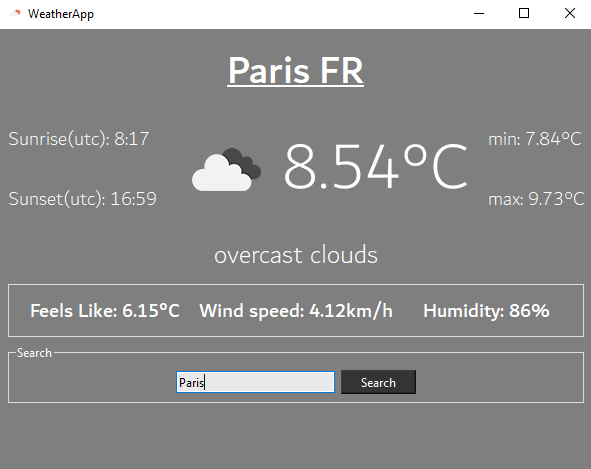

# QT_OpenWeather
Weather GUI with the [OpenWeather API](https://openweathermap.org/) built with [QT6](https://www.qt.io/product/qt6)
 

# v0.1
Download the build in github releases
  

  

# Doxygen :
### Online doc : https://anthonydoucet.github.io/QT_OpenWeather/Doc/index.html
  

# Build it yourself
Add a **token.h** file to the root
>#ifndef TOKEN_H 
>#define TOKEN_H 
> 
>#define API_TOKEN "*token*" 
> 
>#endif // TOKEN_H 

Build with at least QT 5